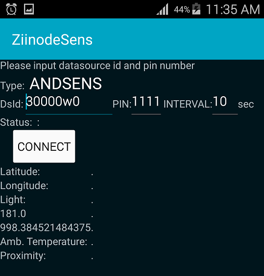

This is Android and JAVA demo application for [www.ziinode.io](www.ziinode.io) IoT cloud service.
It sends android GPS and JAVA memory data to ziinode servers via MQTT treansport.

######Demo application
1. [Download `ZiinodeSens.apk`](http://ziinode.io/get/ZiinodeSens.apk) and install to your phone. Run application; in field `DsId` by default should be named `ANDSENS`, then DsId(Datasource Identification) will be generated automatically(If you want you can type your DsId). This field  allows contain exact seven letters and numbers.

2. In `PIN` field enter own imaginary PIN(letters and digits only).
3. In `ziinodeSens` application press `CONNECT`; application connects to a server to generate DsId and will return `Not registered, please register datasource`. It should be so.
4. Log in to your [ziinode dashboard][http://ziinode.io/graf] or refresh browser(if allready logged) and go to Data sources. **Important: You should log in to ziinode dashboards from same local network as `ziinode gadget` is connected.**
5. In the `side menu` click on a link named Data sources.

	*NOTE: If this link is missing in the side menu it means that your current user does not have the Admin role for the current organization.*

6. Your `mobile phone datasource` should appear in datasource list. Click `Register` and in `Register data source` window change(you can leave it default to) default name and enter the same PIN which you was typed in the ziinodeSens application.
7. Click `Add` button.
8. Come back to your phone and again click `CONNECT`; return should receive Status: `Connected OK`
9. And refresh browser or navigate to another menu and come back to `Data Sources` menu to check if datasource is online.

Read more from [Ziinode Dashboards](http://www.ziinode.io/dashdoc.html) documentation.
